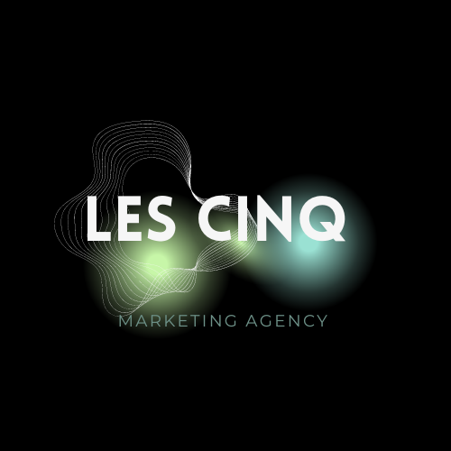

# Project Collectif HTML/CSS

## http://lescinq.000.pe/

## Sommaire
Introduction

Objectifs

Méthodologie

Définition des Objectifs 

- Définition de la stratégie 
- Maquette
- Développement technique 
- Test
- Déploiement

Données

### Introduction

Les Cinq est une équipe dynamique en charge de la création d'une landing page. Composée de cinq membres, cette équipe - Matisse, Théo, Elodie, Ilan et Anis - travaille avec passion sur un site web destiné à mettre en avant les projets de deux autres équipes au sein du CNAM. Chaque membre apporte sa propre expertise, allant du design à la stratégie, créant ainsi une collaboration unique et complémentaire.

### Objectifs

L’objectif de ce projet est de mettre en valeur nos capacité en code et en travail d'équipe et de mettre en valeur le travail des autres équipes afin de voir si nous sommes capables d’effectuer un travail d’équipe et de gérer un délai.

### Méthodologie

Définition des Objectifs :
Réunion de l'équipe pour définir les objectifs de la landing page.
Installation de GitHub pour ceux qui ne l’avait pas afin de facilité le partage des fichiers.
Attribution des rôles aux membres de l'équipe.
Définition de la stratégie :
Élaboration d'une stratégie de contenu en fonction des objectifs (textes, images, appels à l'action).
Maquette :
Création d'une maquette de la landing page avec des outils comme Canva et Photoshop.
Développement technique :
Développement de la structure HTML/CSS.
Utilisation de technologies telles que HTML, CSS, JavaScript pour créer la landing page.
Structure -> HTML
Styles -> CSS
Dynamisme -> Javascript
Création du logo sur Canva.
Test :
Réalisation de tests fonctionnels et de compatibilité sur différents navigateurs et appareils.
Collecte des retours de l'équipe et des utilisateurs pour effectuer des révisions.
Déploiement :
Configuration de l'hébergement.
Vérification finale pour s'assurer que tout fonctionne correctement.

### Données

Lien de la Landing page : http://lescinq.000.pe/?i=1

#### Accés FTP

- Host : tpupload.net
- Port : 21
- User : if0_36125741
- Password : mcrHLmJKC040R

#### Récuparation des projets

- [x] Anis https://opfc.000webhostapp.com/

- [x] Élodie https://louve-noire.go.yo.fr/

- [x] Illan https://hiess-cinema.go.yo.fr/

- [x] Théo https://bracadabras.trveon.com/

- [x] Matisse http://empire-gaming.trveon.com/

- [x] Guillaume https://parcdesmilleroses.000webhostapp.com/

- [x] Jérémy https://dragon-ball-jer.000webhostapp.com/

- [x] Damien F https://manga-passion-cnam.000webhostapp.com/

- [x] Damien B https://porschefactory.000webhostapp.com/

- [x] Pauline https://vais-blog.000webhostapp.com/

- [x] Milos https://paris-cnam.000webhostapp.com/

- [x] Nathalie https://les-annees-80-90.000webhostapp.com/index.html

- [x] Dylan https://dinodynasty.000webhostapp.com/

- [] Chloé

- [x] Gabriella https://alchimypotion.000webhostapp.com/index.html